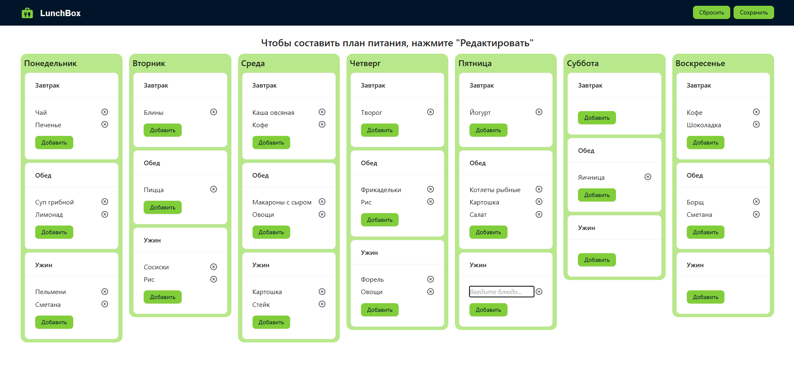
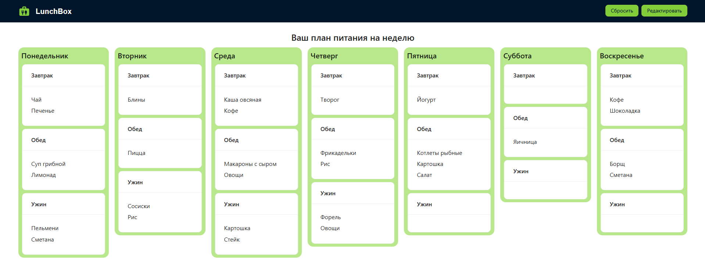

# LunchBox

A simple **weekly meal planner** built with Angular.  
Plan your breakfasts, lunches, and dinners for the whole week in one place.

## Features

- Add meals for each day of the week
- Edit or remove existing meals
- UI-kit based design
- Data stored in browser (localStorage) – works without backend

## Screenshots





## Tech Stack

- [Angular](https://angular.io/)
- UI Kit ([AntDesign](https://ng.ant.design/docs/introduce/en))
- LocalStorage for persistence

## Getting Started

```bash
# clone the repo
git clone https://github.com/wedwincode/lunchbox.git
cd lunchbox

# install dependencies
npm install

# start dev server
ng serve
```
